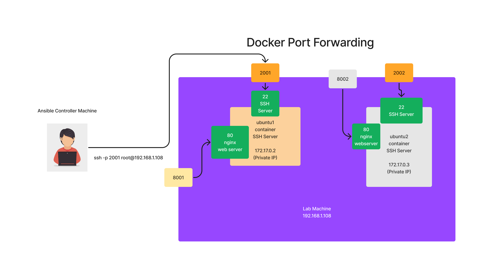

# Day 1

## Linux Repository Servers
<pre>
- Repository Servers are FTP Servers that maintained multiple opensource installer packages that works on many different Linux versions
- For instance, For Ubuntu Linux distribution, the repository server is maintained by Ubuntu organization
  - for each version of ubuntu os, there are dedicated pages/urls maintained in Repository Servers to provide stable version of software installers
</pre>  

## Linux Package Managers
<pre>
- a utility that comes with every Linux distribution
- used to downad/install/uninstall/upgrade/downgrade softwares
- package manager downloads the softwares from a url maintained in repository configuration files
- the package manager is aware from where to download the software
- the package manager will never download a software that is incompatible to a particular linux distribution
- each Linux distribution supports different package managers
- For example
  - In Debian Linux family, i.e ubuntu, there is a package manager called apt or apt-get, snap, etc.,
  - In Red Hat Linux family
    - Fedora, RHEL, Rocky Linux 
    - package manager supported is dnf, yum, rpm, etc.,
</pre>  

## Info - Provisioning Tools Overview
<pre>
- Infrastructure as a code tool (IaaC)
- these tools helps us declartively create Virtual machine in a on-prem, public or private cloud or in a hybrid cloud
- these tools helps us provision storage in private, public or hybrid cloud environments
- provision switches/routers
- provisioning networks
- examples
  - AWS Cloudformation
  - Terraform
  - Docker
  - Vagrant
</pre>  

## Info - Configuration Management Tool Overview
<pre>
- assumption there is already a machine with some OS installed on it, on a already provisioned machine, configuration management tools can help automate the below activities
- helps us automative system administrative activities
  - software installation
  - software uninstallation
  - update/upgrading/downgrading softwares
  - managing users
    - creating a windows/linux/unix/mac user
    - editing a windows/linux/unix/mac user rights
    - deleting a windows/linux/unix/mac user
    - updating user details, credentials, etc.,
  - adding a windows/linux/unix server to a domain
  - removing a windows/linux/unix server from a domain
    - installing software patches
- managing switches/routers
- creating a vlan, editing, updating network stuffs
- examples
  - Puppet
  - Chef
  - Salt/Salt Stack
  - Ansible
</pre>

## Info - Puppet Overview
<pre>
- is one of the oldest configuration management tool
- uses its own proprietary declarative language called Puppet language to write automation scripts
- follows client/server architecture
- DSL(Domain Specific Language) - language used to write the automation 
- DSL - Puppet Language
- follows Pull based architecture
- installing Puppet is a complex activity
- learning curve is also steep
- a special Puppet agent must be installed on all servers that must be managed by Puppet
- comes in two flavours
  - opensource
  - enterprise product
</pre>

## Info - Chef Overview
<pre>
- chef is one of the very popular configuration management tools available in the market
- follows client/server and pull based architecture
- DSL used in Chef is Ruby scripting language
- installation and learning is quite difficult
- Chef comes with many tools, hence mastering chef takes very long time
- architecture wise, somewhat similar to Puppet
- a special Chef agent must be installed on all servers that must be managed by Chef
</pre>

## Info - Ansible Overview
<pre>
- is the youngest configuration management tool 
- it is developed in Python by Michael Deehan
- Michael Deehaan is a x employee of Red Hat
- Michael Deehan started a company called Ansible Inc, Ansible core was developed as an open source product
- Ansible follows a very simple architecture
- Installation of Ansible is very easy
- Easy to learn and master Ansible
- Ansible is agent-less
- Ansible comes in 3 flavours
  1. Ansible Core - opensource product, supports only command line interface
  2. AWX - open source product developed on top of Ansible Core, supports Web Interface
  3. Red Hat Ansible Automation Platform ( earlier called as Ansible Tower )
     - developed on top of the open source AWX
     - supports web interface
     - also can expect world-wide support
     - Red Hat is an IBM company
</pre>

## Info - Ansible Module
<pre>
- Ansible comes with many ansible modules
- ansible modules are reusable code that automates one functionality
- For example
  - to copy files from local machine to remove ansible linux node, there is an ansible module called copy
  - to manage files/folders, there is an ansible module called file
  - to manage services, there is a module called service
</pre>

## Info - Ansible ad-hoc command
- ansible ad-hoc command is just invoking a single ansible module without writing a playbook
- usually helps us understand what features a individual modules has, it is way we can experiment a module before using them in playbooks
- each command just invokes one Ansible module

## Info - Ansible Playbook
- is a YAML file, hence can be written using any plain text editor of your choice
- it follows a specific structure or format
- each Playbook has one or more Play
- each Play targets one to many hosts(ansible nodes to perform the automation)
- each Play runs zero to many Tasks
- each Task runs exactly one Ansible module
- each Play runs zero to many Roles

## Info - Ansible Controller Machine ( ACM )
- the machine where Ansible is installed is called Ansible Controller Machine
- officially only a Linux machine can be an Ansible Controller Machine
- Windows machines can't be an Ansible Controller Machine
- the machine where we run the ansible playbook is called Ansible Controller Machine

## Info - Ansible Node ( these are the machines where Ansible will perform the automation )
- it can be a Windows machine
- it can be a Linux machine
- it can be an unix machine
- it can be a Mac machine
- it can be Network routers/switches

## Info - Ansible Inventory
- it is a text file, who looks somewhat similar INI file
- it has the connection details of Ansible Nodes
- if the Ansible node happens to be a Window machine, then it will have WinRM connection details, login credentials, etc
- if the Ansible node happens to be a Unix/Linux/Mac/Switches/routers, then it have SSH connection details, login credentials, etc.,

## Info - Install Ansible in Ubuntu
```
sudo apt update
sudo apt install software-properties-common
udo add-apt-repository --yes --update ppa:ansible/ansible
sudo apt install ansible
```
## Info - Ansible High Level Architecture 


## Lab - Build Custom Ubuntu Docker images to create ansible node containers
Let's create a key pair ( public and private ) keys
```
ssh-keygen
```

Expected output


Let's build custom ubuntu based ansibe node docker image as shown below
```
cd ~/terraform-2428-feb2025
git pull
cd Day1/CustomDockerAnsibleNodeImages/ubuntu-ansible
cp ~/.ssh/id_ed25519.pub authorized_keys
docker build -t tektutor/ubuntu-ansible-node:1.0 .
rm authorized_keys
docker images
```

Expected output


## Lab - Let's create couple of ubuntu ansible node containers using our custom docker image


```
docker run -d --name ubuntu1 --hostname ubuntu1 -p 2001:22 -p 8001:80 tektutor/ubuntu-ansible-node:1.0
docker run -d --name ubuntu2 --hostname ubuntu2 -p 2002:22 -p 8002:80 tektutor/ubuntu-ansible-node:1.0
docker ps
```

Expected output


## Lab - Check if you are able to SSH into ubuntu1 ansible node container
```
ssh -p 2001 root@localhost
exit
ssh -p 2002 root@localhost
exit
```
Expected output


## Lab - Creating a static inventory file
```
cd ~/terraform-2428-feb2025
git pull
cd Day1/static-inventory
cat hosts
ansible -i hosts all -m ping
```

Expected output


## Lab - Dynamic inventory file
```
cd ~/terraform-2428-feb2025
git pull
cd Day1/dynamic-inventory
cat ./dynamic-inventory.py
ansible -i ./dynamic-inventory.py all -m ping
```

Expected output


## Lab - Ansible config file
Create a file name /tmp/.ansible.cfg with the below content
```
inventory=/home/rps/terraform-2428-feb2025/Day1/dynamic-inventory/dynamic-inventory.py
```

Export the environment 
```
export ANSIBLE_CONFIG=/tmp/.ansible.cfg
```

Run ping ansible ad-hoc command
```
cd ~
ansible all -m ping
```

Expected output


## Lab - Running your first ansible playbook
```
cd ~/terraform-2428-feb2025
git pull
cd Day1/ansible
cat ping-playbook.yml
ansible-playbook -i inventory ping-playbook.yml
```

Expected output


In the above screenshot, 
- hosts is a section that tells ansible the targetted ansible node servers
- under the tasks section, we have defined a single task
- Ping ansible node is the task description which is optional, but it is best practice
- ping: is the ansible module we are invoking as part of the task

## Lab - Playbook with multiple play 
```
cd ~/terraform-2428-feb2025
git pull
cd Day1/ansible
cat ping-playbook.yml
ansible-playbook -i inventory ping-playbook.yml
```

Expected output


